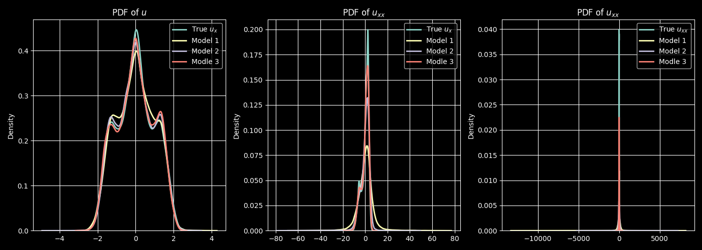

<body style="background-color:#121212; link-color:#FF0000">

# Neural dynamical operators

### Eric Leonard, Connor Sanderford, Matthew Watkins

### AMATH 575

## Background

Neural operators learn maps between function spaces.[^1] Suppose we have function spaces $\mathcal{A}$ and $\mathcal{U}$, and some operator mapping between them $\mathcal{G}$. We do not observe $\mathcal{G}$ directly; instead we have pairings $\{(a_j, u_j)\}_1^n$, where $a_j$ and $u_j$ are functions such that $\mathcal{G}(a_j) = u_j$. We also often do not have direct access to the functions $\{(a_j, u_j)\}_1^n$, but instead point values of the functions sampled on some (potentially non-homogeneous) mesh over the domains of the functions.

A neural operator approximates $\mathcal{G}$ by parametrizing it as a composition of integral operators and nonlinearities. While a number of different choices may be made for the structure of the integral operator, the basic form is the linear one:

$$u(y) = K[a](y ; \theta) = \int_\Omega \kappa(x,y ; \theta) a(x) dx$$

where $\kappa$ is a kernel function and $\theta$ is the set of parameters to be learned defining the kernel function.

A single layer of a (single-channel) neural operator is then given by 

$$u(y) = \sigma \left( \int_\Omega \kappa(x,y ; \theta) a(x) dx + b(y; \theta) \right)$$

where $b$ is a bias function again parametrized by $\theta$, and $\sigma$ is a chosen activation function. Since only point values of $a$ and $u$ at some $x_i$ and $y_j$ are known, the integral is approximated by quadrature.

### Fourier neural operators

When the operator to be approximated is a convolution, it may be parametrized in the Fourier domain:

$$u(y) = \sigma \left( \mathcal{F}^{-1}( r(\xi;\theta) \mathcal{F}(a(x))) + b(y; \theta) \right)$$

where $r(\xi;\theta)$ is the Fourier transform of a periodic function. If we choose to assume the function has a finite Fourier series, then all the modes above a given frequency are zero, and $u$ itself is constrained to have no frequency content above the truncation aside from that added by the bias function, naturally smoothing $u$ and acting as a form of implicit regularization.

### Neural dynamical operators

The problem of a data-driven approach for learning a dynamical system has been widely explored. The Neural Dynamical Operator (NDO), proposed by Chuanqi Chen and Jin Long Wu [^2] is a particularly nice formulation. The paper sought to propose a general model for deep neural data-driven methods for learning dynamical systems, and the NDO has a few key properties that make it desirable. 

The NDO aims to solve the following problem. Consider a dynamical system of the form:

$$\frac{\partial \textbf{u}(\textbf{x},t)}{\partial t} = \mathcal{G}(\textbf{u}(\textbf{x},t),t)$$

where $\textbf{x}\in D_x\subseteq\mathbb{R}^{d_x}$ is the spatial component, $t\in[0,T]\subset\mathbb{R}$ is the temporal component, and $\textbf{u}(\cdot,t)$ is the state of the system at a given time. Rather than assuming some fixed discretization according to the data we have, the NDO aims to learn the nonlinear continuous operator $\mathcal{G}$ this is done via a deep neural learning method where a parametrized approximation $\tilde{\mathcal{G}}(\tilde{\textbf{u}}(\textbf{x}, t), t ;\boldsymbol{\theta})$ is learned by minimizing the loss:

$$L_s = \sum_{n=0}^{N_s}J_s(\textbf{u}(t_n), \tilde{\textbf{u}}(t_n))$$

where $\{\textbf{u}(t_n)\}_{n=0}^N$ is the time series data, $\tilde{\textbf{u}}(t_n) = \int_{t_0}^{t_n}\tilde{\mathcal{G}}(\textbf{u},t;\boldsymbol{\theta})$, and $J_s$ is a loss function at every time step.[^2] The NDO constructs this operator using an FNO, by updating model parameters $\boldsymbol{\theta}$ to match short-time trajectories via a gradient-based method like neural ODE.

### Resolution invariance

Since the NDO learns a continuous operator built on the FNO framework, the NDO assumes no discretization in the model, it instead updates model parameters using a discrete set of data to learn a continuous mapping. This has the benefit of providing spatial resolution invariance to the model. Additionally the Neural ODE takes advantage of continuous integration methods:

$$\tilde{\textbf{u}}(t + \delta t) = \int_{t}^{t + \delta t}\tilde{\mathcal{G}}(\textbf{u},t;\boldsymbol{\theta}).$$

which introduces temporal resolution invariance into the NDO as well. This is because you can choose any discretization to integrate the model production that you want. This means that the model framework performs well in a variety of data regimes. In practice many systems of interest have data with inconsistent resolutions or they deman non-uniform resolutions to efficiently characterize the system, e.g. GIS data, LiDAR, high-fidelity simulations, etc.[^2] This resolution invariance allows the model to handle mixed resolution data well, without increasing computational cost or propagating errors to make predictions at particular times. 

### Long term stability via hybrid optimization

In addition to the spatiotemporal resolution invariance, the NDO also proposes an optimization framework that allows for better long-term prediction stability. This is done by long-term time-averaged statistics matching between the model and the data. This means that the model is actually being trained on two types of data. First, it is trained using a gradient based approach as outlined previously to minimize loss for short-term trajectory matching. This utilizes the time series system state data $\{\textbf{u}(t_n)\}_{n=0}$. Then using the mapping $\beta(\{\textbf{u}(t_n)\}_{n=0})$ that maps long-term trajectories to the important statistics, we can minimize the following loss term to further calibrate the model parameters $\boldsymbol{\theta}$:

$$L_\ell =[\beta(\{\textbf{u}(t_n)\}_{n=0}^{N_\ell}),\beta(\{\textbf{u}(t_n)\}_{n=0}^{N_\ell})]$$

By incorporating a hybrid optimization scheme that optimizes the model parameters $\boldsymbol{\theta}$ using the two loss functions for the two different datasets allows for both the short term trajectory matching, and long term statistics matching. This ensures the model has greater predictive power longer term, and that the qualitative behavior of the learned model more closely matches the true underlying behavior of the system. First the gradient approach is used to minimize $L_s$, then a gradient free approach can be used to minimize $L_\ell$. In particular ensemble Kalman inversion (EKI) can solve the optimization problem associated with $L_\ell$. EKI provides an optimization scheme for general inverse problems with noisy data of the form:

$$\textbf{y} = G(\boldsymbol{\theta) + \boldsymbol{\eta}}$$

where $\textbf{y}$ is observed data, $G$ is a forward map, and $\eta$ is noise, typically assumed to be Gaussian. For our purposes $\textbf{y} = \{\beta(\textbf{u}(t_n))\}_{n=0}^{N_\ell}$, $\beta$ calculates time-averaged statistics from a time series of system states, and $G$ is the composition of the operator $\tilde{\mathcal{G}}$ and a time integral:

$$G(\boldsymbol{\theta}) = \{\beta(\textbf{u}(t_n))\}_{n=0}^{N_\ell} = \beta\left(\{\textbf{u}(t_0) + \int_{t_0}^{t_n}\tilde{\mathcal{G}}(\tilde{u}(\textbf{x}, t), t; \boldsymbol{\theta})\right)$$

EKI is then applied to $G$ to learn the optimal parameters $\boldsymbol{\theta}$ and match the time-averaged statistics of the model against the data.[^2]

### Ill-posedness

A problem is well-posed if it meets the three criteria of the Hadamard Conditions: 

- The solution exists
- The solution is unique
- The solution changes continuously with respect to the initial conditions

The Condition Number of a function measures the magnitude of change given some small change in input. We may use this to determine whether a problem meets the third Hadamard Condition of continuous change. We consider this in regards to how sensitive some function, in our work this being a differential equation or its corresponding inverse problem, is to perturbations in the input. Put another way, the Condition Number represents the rate at which a solution will diverge for some perturbation, similar to a Lyapunov Exponent. A high condition number means that a problem is thus ill-posed, or at least highly sensitive to initial conditions.

For a linear function given by some matrix, the Condition Number is given by the ratio of the largest singular value to the smallest singular value. For a dynamical system, the Lyapunov Exponent is given by the exponential rate of change of some solution from another given some initial perturbation, of relative size. For such problems, a highly stable forward problem often results in a highly unstable, or ill-posed inverse problem.

### Inverse problems

A forward problem begins with some initial state and a method for propagating the state forward in time, while an inverse problem attempts to calculate the causes that led to some final state, and reproduce the initial state. In our work, we consider forward problems given by differential equations, and their associated inverse problems which involves attempting to learn the reverse equations. Such problems in dynamical systems are not necessarily well-posed. Taking the Heat Equation as an example, the forward equation is well-posed as it has a unique solution and is continuous with respect to initial conditions. Even further, in the long-time view of the equation, all initial conditions will converge to the same state. Because the equation is essentially a smoothing function, there is a stable fixed point which attracts all states, resulting in a very low Condition Number, or a asymptotically stable point in regards to Lyapunov Exponents. In the inverse equation, however, this stability results in a large Lyapunov exponent, or very high Condition Number, meaning the inverse problem is actually ill-posed, as it is highly sensitive to perturbations in the conditions.

## Methods

### The inverted heat equation

We learn three different surrogate models for inverting the heat equation. The first is an ordinary convolutional neural network with three hidden layers, the only modification being residual connections between layers to aid in approximating identity. At each layer we choose the number of channels to be $16$, and a kernel size of $5 \times 5$, aside from the final layer with a kernel size of $7 \times 7$. We chose LeakyReLU with a slope of $0.1$ left of zero as the activation function, to avoid the dead ReLU problem.

The second is a two-dimensional Fourier neural operator, imported from the neuraloperator package[^1] [^3]. We choose the number of channels to be $32$ (since there will not be multiple hidden layers in this model), and to retain $16$ vertical and $16$ horizontal Fourier modes. Both the CNN and FNO are trained in order to directly approximate some fixed backward timestep, using an ordinary mean-squared error loss functional.

The third is the neural dynamical operator. The internal Fourier neural operator has precisely the same parameters as the FNO surrogate model. Instead of training the NDO to approximate some fixed backward timestep, the internal FNO is taken to be the approximation to the right-hand side of the PDE, and given as an input to a solver. The solver then integrates in inverse time to an estimate of the initial condition, the estimated and true initial condition are compared by the loss functional, and the gradients are then backpropagated through the solver. We used the odeint solver from torchdiffeq for this purpose.[^4] Again, the loss functional is the ordinary mean-squared error.

Data was generated by sampling images from MNIST as initial conditions to the heat equation with Neumann boundary conditions. We took the constant $\kappa = 0.05$, chose a timestep $dt = 0.5$, and solved the heat equation up to time $t = 100$. The CNN and FNO were trained on each backward timestep for the sampled trajectories, whereas the NDO was trained only on the final and initial states. No noise was injected into the inputs for any model during training

## Results

### Kuramoto-Sivashinsky

| | model 1 | model 2 | model 3| 
|:--: | :--:| :--: | :--: |
| $dx$ | $22/1024$ |$22/512$ |$22/256$ |
| $dt$ | $0.25$| $1.0$|$2.0$ |

*Table 1. Recreation of KSE spatial temporal solutions. Three models  trained at different resolutions show similar results on the same test data.* 

|  | 
|:--:| 
| *Fig. 1. Recreation of KSE spatial temporal solutions. Three models  trained at different resolutions show similar results on the same test data.* |

|  | 
|:--:| 
| *Fig. 2. Backward trajectories for the CNN, FNO, and NDO methods. Bottom row shows the $\sup$ norm of the difference between the true backward trajectory and the estimated one at a given time.* |

### Comparison to the true trajectory for noisy final conditions

Figure 3 shows the backward trajectories estimated by the surrogates under noisy conditions. The final conditions are contaminated with added Gaussian noise at a noise level of $0.05$ ($\|\text{noise}\|_2 = 0.05 \|u_{\text{final}}\|_2$). The backward trajectories are then estimated, either by iterative application of the model for the CNN and FNO, or by the solver technique for the NDO.

|  | 
|:--:| 
| *Fig. 3. Backward trajectories for the CNN, FNO, and NDO methods. Bottom row shows the $\sup$ norm of the difference between the true backward trajectory and the estimated one at a given time.* |

The behavior of the CNN is the expected result for a naive solution to an ill-posed problem. Without regularization, the small singular values of the forward operator result in massive singular values for the inverse operator, which magnify any noise in the observations to such an extent that they destroy the whole structure of the solution. On the other hand, the FNO is more characteristic of solutions under regularization. Since the forward operator is a Gaussian, it attenuates higher frequency components of the solution, and therefore we expect the inverse to amplify these components. But since higher Fourier modes are truncated by the operator, these cannot come to dominate the solution nearly so badly.

We note the NDO performs best of all, but also that in examining the plots of $\sup(|u - u_{\text{true}}|)$, the NDO plot appears to be very nearly the first ~third or so of the FNO plot. We think this suggests that the reason the NDO outperforms the FNO is that by using a modern solver with adaptive timestepping, the final condition can be propagated back to the initial condition with a far fewer number of function evaluations, which reduces the cumulative amplification of noise.

### Comparison to the true initial condition as a function of noise level

Figure 4 shows the estimated initial conditions for each surrogate, as a function of the level of noise added to the final condition. We measure the quality of the estimated initial condition using relative reconstruction error; $\text{RRE}(u_0) =  \frac{\|u_0 - u_{0,\text{true}}\|_2}{ \|u_{0,\text{true}}\|_2}$.

|  | 
|:--:| 
| *Fig. 4. Estimated solutions for the CNN, FNO, and NDO methods as a function of the noise level. Bottom row shows the relative reconstruction error between the true and estimated initial condition at a given noise level.* |

For the CNN, we note that even the zero-noise instance has already blown up, likely due to truncation error. The FNO again shows behavior which varies smoothly with respect to the size of the perturbation, characteristic of regularization. The NDO again performs best of all, we imagine for the same reason.

### Stability of solutions past the initial condition

Figure 5 shows the backward trajectories estimated by the surrogates past the initial condition time, now under noiseless conditions. The plots show the distance (in the $\sup$ norm sense) between the true initial condition, and the trajectories at a given time. Again, the CNN blows up (though slower).

|  | 
|:--:| 
| *Fig. 5. Asymptotic behavior for the CNN, FNO, and NDO methods. Bottom row shows the $\sup$ norm of the difference between the true initial condition, and the estimated solution at a given time.* |

We note that the FNO never achieves a result as close to the true initial condition as the NDO, but that the FNO does appear to stabilize, but the NDO does not! We think this may be a consequence of using the solver. If the adaptive timesteps of the solver grow larger in proportion with the requested interval of integration, then the updates should grow in proportion with the timesteps, consistent with the linear growth of the difference and yet the absence of any change in the structure of the solution.

## Future work

### Loss functionals and regularization

The heat equation with Neumann boundary conditions preserves the $L_1$ norm of the solution. Consequently, we should expect not only for the final and initial conditions to have the same $L_1$ norm, but also for all intermediate timesteps to share the same norm. For the CNN and FNO, this could be achieved by penalizing the sum of the differences of the $L_1$ norm of the intermediate solutions and the $L_1$ norm of the final condition, that is, $\sum_{t=1}^n |\|u_t\|_1 - \|u_{0, \text{true}}\|_1$. 

For the NDO, we do not necessarily have access to intermediate solutions. Instead, we could use the 1-Wasserstein distance,

$$W_1(u, u') = \inf_{\pi \in \Pi} \int \|x - x' d \pi(x, x')\|$$

where $\pi \in \Pi$ if $\int_X d \pi(\cdot, x') = u$ and $\int_X d \pi(x, \cdot) = u'$.

In other words, $W_1(u, u')$ represents the smallest possible cumulative distance required to shift the mass of the distribution $u$ to the distribution $u'$, and so using it as a loss functional, we would seek the operator which would most efficiently transport the mass back to the initial condition.

### Connections to diffusion models

Loss functions like the Wasserstein distance are common in optimal transport and generative modeling, where the goal is to match distributions. The first, more immediate connection to make is that conditional inversion of the heat equation is already a technique used for generative modeling of images.[^5] Much like the better-known diffusion models, which invert the process of repeatedly contaminating images with noise by guiding the inverse process with conditional information about the image, the heat dissipation process is inverted by the same means. These models generally utilize some fixed time schedule (or some set of them) chosen separately from the model which determines the conditional probability of the next step of inversion given the previous. NDOs might be a means of both performing adaptive time stepping for diffusion models, while also uniting the stepping scheme with the conditional probability model.

The second connection is to note that the forward heat equation corresponds to the evolution of the corresponding density of a pure-diffusion stochastic differential equation. So an alternative way to think about this neural operator is that it is observing some final density of the motion of a Brownian particle on $\mathbb{R}^2$ after some time, and predicting the initial density. One might then take the maximum likelihood estimate of the initial position by maximizing the predicted initial distribution. We extend this to images by considering each pixel a coordinate in this way.

### Operators with side parameters

For useful generative models, we need some way of injecting the conditional information that guides the inversion to the desired result. Score-based diffusion models do this by using an aligned text embedding model and image classifier - in other words, the pair have been trained on image and caption data in such a way that the classification of an image and the associated embedding of its caption are very near. This way, a caption of the desired image can be embedded, and each inversion step can be guided by using the classifier to do maximum likelihood estimation of the next step with respect to the embedding.

But neural operators have already been adapted to take embeddings as side parameters. The continuous-time neural operator, intended to be used for PDEs, takes a time as a parameter, embeds it, and then incorporates the embedding into the model weights in order to infer arbitrary future timepoints without any timestepping at all.[^6] Similarly, text embeddings might be used to guide the inverse diffusion process without ever requiring expensive maximum likelihood estimation.

## References

[^1]: J. Kossaifi, N. Kovachki, Z. Li, D. Pitt, M. Liu-Schiaffini, R. J. George, B. Bonev, K. Azizzadenesheli, J. Berner, and A. Anandkumar. A library for learning neural operators, 2024.

[^2]: C. Chen and J.-L. Wu. Neural dynamical operator: Continuous spatial-temporal model with gradient-based and
derivative-free optimization methods. Journal of Computational Physics, 520:113480, 2025.

[^3]: N. B. Kovachki, Z. Li, B. Liu, K. Azizzadenesheli, K. Bhattacharya, A. M. Stuart, and A. Anandkumar. Neural operator: Learning maps between function spaces. CoRR, abs/2108.08481, 2021.

[^4]: R. T. Q. Chen. torchdiffeq, 2018.

[^5]: S. Rissanen, M. Heinonen, and A. Solin. Generative modelling with inverse heat dissipation, 2023.

[^6]: Y. Park, J. Choi, C. Yoon, C. hoon Song, and M. Kang. Learning pde solution operator for continuous modeling of time-series, 2023.

## Appendix

Find our notebooks [here](https://github.com/crsanderford/575_project).